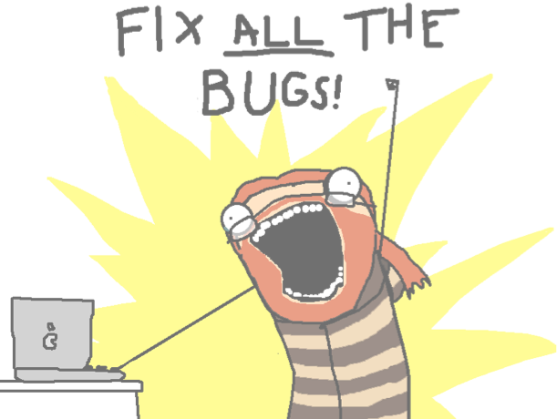
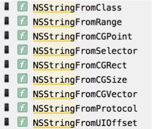
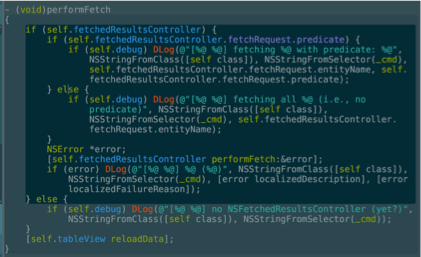
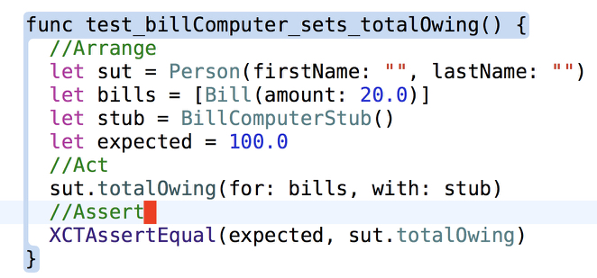
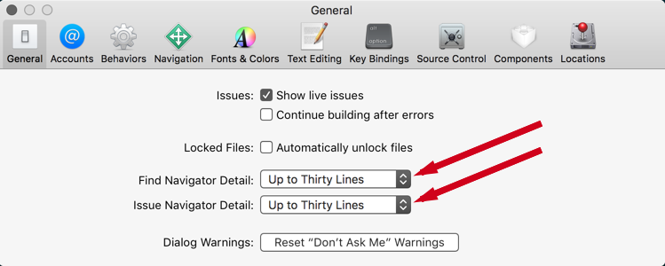

iOS Debugging & Instruments
===========================



Overview
========

* Alternatives to Debugging
  * Print statements
  * Asserts
* Important Xcode Settings
* Debugger Tour
* Instruments: Allocations/Time Profiler
* Debugging Advice
* Practice Debugging
* Essential Tools

What I don’t cover
------------------

* This is just an intro.
* I don’t cover LLDB commands.
* The debugger has a whole CL interface that is very powerful.
* Advice: Instead of learning LLDB commands become a unit test master!

NSLog/Print
===========

* Some log tricks

```objc
// Objc

NSLog(@"%d: %s", __LINE__, __PRETTY_FUNCTION__);

```

```swift
// Swift

/*
#file
#function
#line
#column
*/

// print is a variadic function

print(#file, #function, #line, #column)


```


* Convenience methods in Objc for converting primitives to NSString (handy for doing print statements and other things in Objc)



```objc

CGRect rect = CGRectMake(0, 0, 100, 100);
NSLog(@"%@", NSStringFromCGRect(rect));

NSLog(@"%@", @(10).stringValue);

// Swift treats CGRect as a Swift Struct!
print(rect)

```

The Good & Bad of Print/Assert Statements
-----------------------------

* Good
  * Easy, immediate, essential
* Bad
  * Called “cowboy debugging” for reason
  * Can introduce bugs. (You're adding testing to production code. Don't.)
  * Need to be removed before shipping.
  * DLog/ALog & other alternatives automatically removed from release builds.
  * Swift automatically removes Assert from release builds.
  * Makes code harder to read.
  * "Busy console" problem. (Solution: print the line/function in the console).

```swift
// Eg.

print("======>>>>>>!!!!!! HEY !!!!!!!<<<<<<=========")
```

NSAssert/Assert
---------------

* We’ve seen Asserts in the tests exercise (eg. XCTestAssertNil()), and unit testing lecture.
* Plain Asserts are functions that take 2 parameters.
  * The first parameter is some statement that is being asserted to be *true*.
  * The second, optional parameter, is a message that is logged only if the assertion fails. (This can be a format string).
* Assertions assert something to be true, and if that statement is not true the app crashes and dumps the message to the console.

```objc

// Objc
NSAssert(self.data, @"data should not be nil");

NSAssert(self.data.count == 20, @"%@ was expected to be equal to 20", @(self.data.count).stringValue);

```

```swift
// Swift
let num = 10
assert(num == 10, "This message will not run because num is 10")
assert(num == 11, "\(num) is not equal to 11")

```

* Question
  * Why would you ever want to force your app to crash?

* Problem with Asserts
  * They should be removed from production code (automatic in Swift).
  * But you can use macros that automatically remove them from production code in Objc (eg. ZAssert).
  * You’re adding code to your *app* target to do testing. Don't.
  * Might as well write unit tests instead! Unit tests are asserts. But they live in a separate target from your production code. Much smarter. **UNIT TESTS == BETTER**.
  * But for quick tests in an app that isn’t using unit tests, it’s a reasonable choice.

Helpful Xcode Pro Settings
--------------------------

### Folding Ribbon

* Ribbon folding was removed from Xcode 9.

* Xcode 9 supports a version of the Ribbon Folding by holding down ⌘ + bring the mouse pointer over the first word in a function or class.


* Great for solving scope issues.
* But it’s likely a "code smell" if you have to use the ribbon to figure out your scopes.
* Repeated conditional statements or switches ARE almost always a code smell.


### Show Full Error Messages in Sidebar

* Settings \> General in Xcode, increase number of lines for errors!



Debugger
--------

* ==>> Debugger Demo: Open **BreakPointsTourSwift <<==**

Instruments
-----------

* Xcode has a massive instruments feature used for debugging and performance tuning.
* We’ll just look very briefly at two of the most useful instruments.
  * Allocations: takes a snapshot of all of the objects your app allocates, retains and releases.
  * Time Profiler: gives you data on how long your app is spending running various methods.

==>> Instruments Demo (Open: **AllocationsTest** & **TimeProfiler**) <<==

Debugging Strategies
--------------------

* Avoid stabbing in the dark. THINK before changing anything.
* My Technique:
  * Describe problem thoroughly. 
  * Try to describe the precise conditions that trigger **unexpected** behaviour. 
  * If you need more info, gather it. THINK, don’t just start stabbing into the dark (i.e. commenting out lines **superstitiously**).
  * Form a hypothesis. 
  * Start with most obvious and easy to test.
  * Test your hypothesis.
  * If that isn’t it, go to the next most obvious cause.
  * Repeat until you find the problem and solve it.
  * Document your results in a Solutions Log (Agile Best Practice).
  * Always take any compiler errors seriously. Decrypt them first.
  * Get in the habit of solving problems yourself before looking them up on SO.
  * Consider that a problem might have more than a single cause. 
  * Avoid complex problems by a practice of continuous testing. Better yet use TDD.
  * When building always try to get your code to a testable state, test and then move to building the next element.
  * Learn to write unit tests.

Debugger Exercise
-----------------

* Let’s work on the debugger exercise
* Open ==>> **DebuggingExerciseSwift** <<==

Some Important Tools
--------------------

### Viewing Diff Files:

* [SourceTree](https://www.sourcetreeapp.com)
* [P4Merge](https://www.perforce.com/product/components/perforce-visual-merge-and-diff-tools)
* [Git Tower](https://www.git-tower.com/mac/)
* [Fork](https://git-fork.com)
* [Kaleidoscope](http://www.kaleidoscopeapp.com)

### Networking:

* [Paw](https://itunes.apple.com/ca/app/paw-http-rest-client/id584653203?mt=12)
* [Postman Chrome Extension](https://chrome.google.com/webstore/detail/postman/fhbjgbiflinjbdggehcddcbncdddomop?hl=en)
* [Charles Proxy](https://www.charlesproxy.com)

References
----------

* <https://developer.apple.com/support/debugging/>
* <https://developer.apple.com/library/ios/documentation/DeveloperTools/Conceptual/debugging_with_xcode/chapters/debugging_tools.html>
* <https://developer.apple.com/library/content/documentation/DeveloperTools/Conceptual/InstrumentsUserGuide/index.html>
* <http://lldb.llvm.org>
* <http://jeffreysambells.com/2014/01/14/using-breakpoints-in-xcode>
